# Deploying and Debugging Models and Pipelines
### Author: Lucas V. Oliveira

## Table of Contents
1. [Overview](#overview)
2. [Architectural Diagram](#architectural-diagram)
3. [Key Steps](#key-steps)
4. [Screen Recording](#screen-recording)

## Overview

In this project we are using the [bank marketing dataset](https://archive.ics.uci.edu/ml/datasets/bank+marketing) to do two things:
- Train a model using Azure AutoML, deploying the best model and debugging its webservice;
- Create, run and publish a pipeline to trigger automatically a model training using Azure AutoML.

## Architectural Diagram
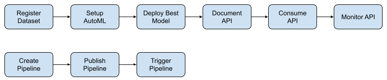

## Key Steps

### Register Dataset
In this step we register dataset that will be used in the project.
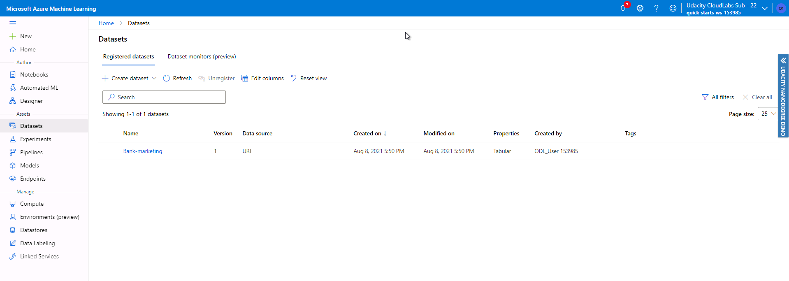

### Setup AutoML Experiment
Here we setup and run an AutoML experiment with the previous registered dataset in order to generate a well performing machine learning model.

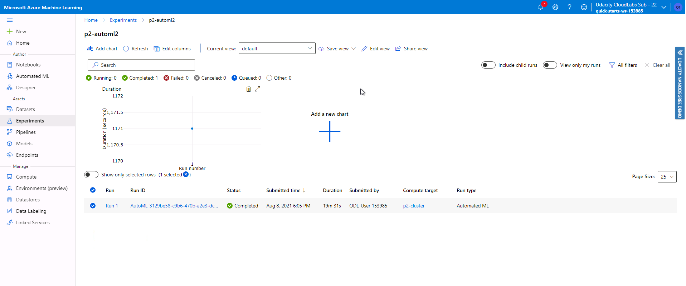

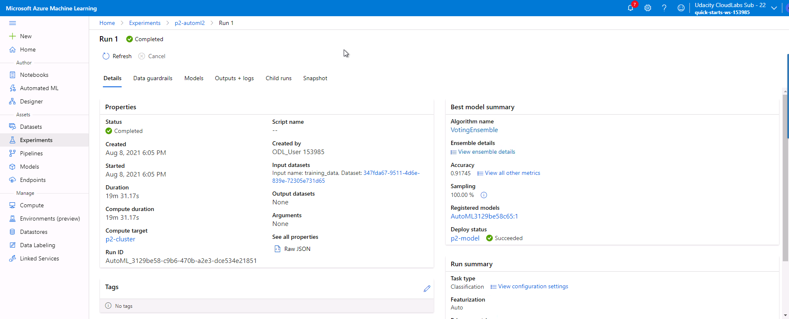

### Deploy the Best Model API
Here we pick the best model found by the AutoML and deploy it so we can make requests to it using a REST API.

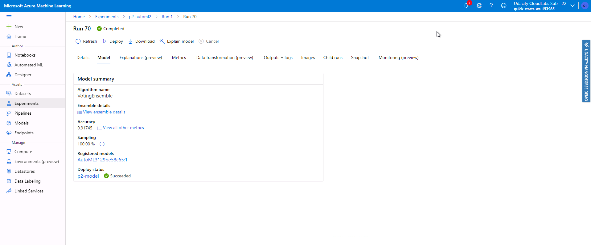
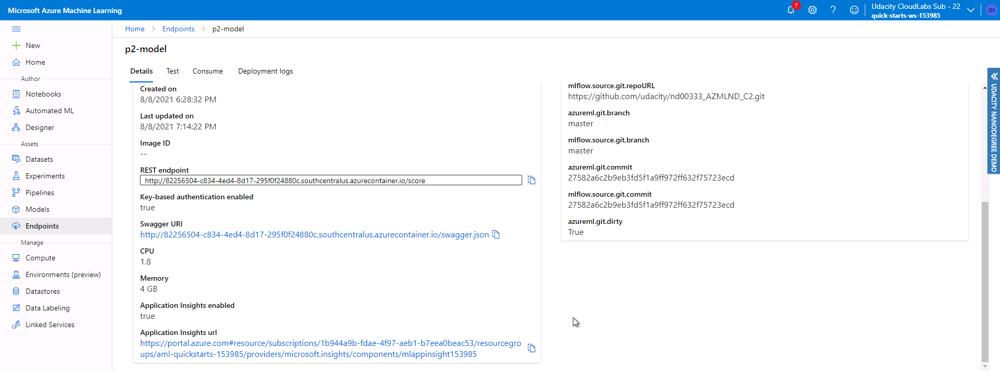

### Document API
In this step we use Swagger to expose our model API documentation methods so we can make use of them to get predictions.
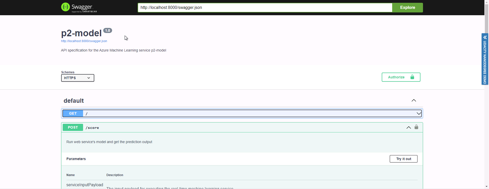

### Consume API
Using the methods shown in the documentation perform requests to the API and get predictions from it.
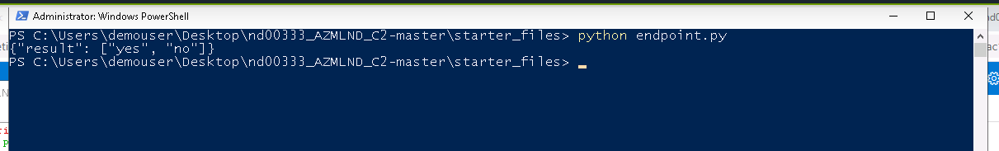

### Monitor API
In this step we monitor the usage of our deployed model. We can retrieve its logs of access, errors and also using application insights to get graphs with data about its usage.

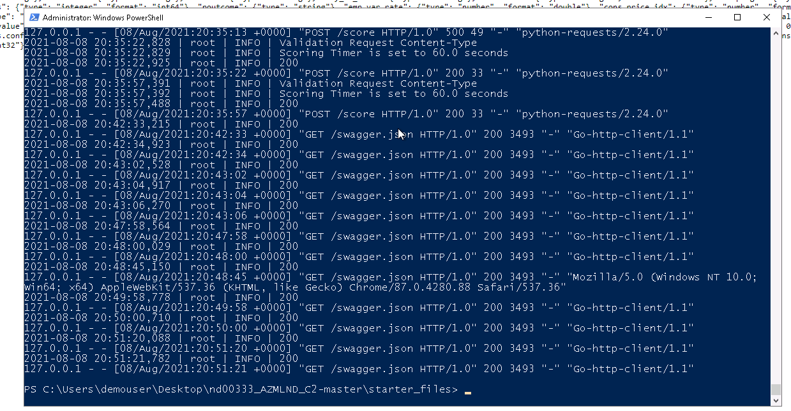

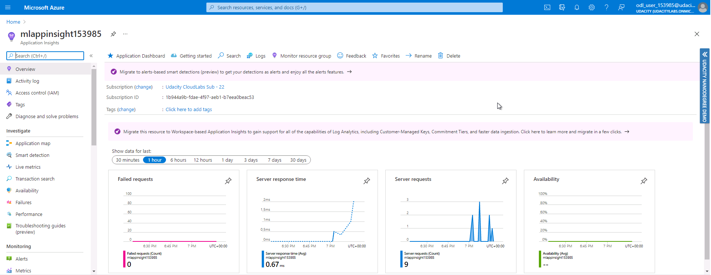

### Create Pipeline
In this step we create a pipeline to load the dataset into an AutoML experiment and run it.
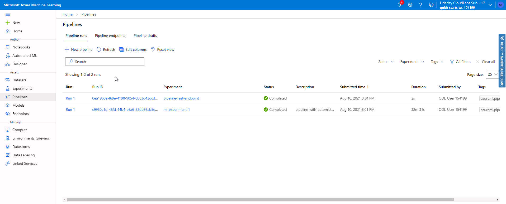
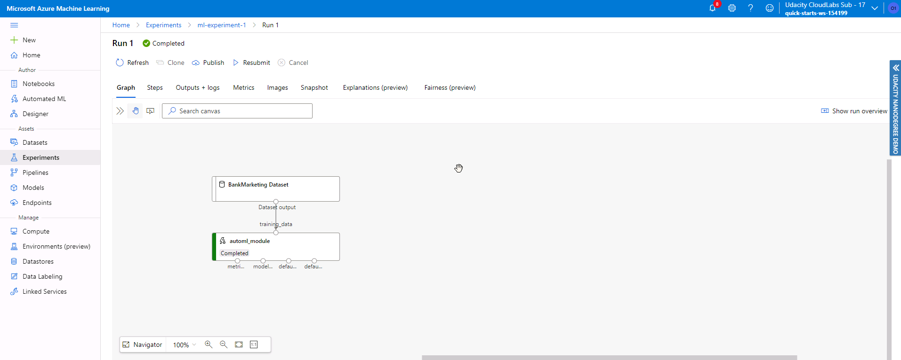

### Publish Pipeline
Here we publish the create pipeline so it can be triggered by a REST endpoint.
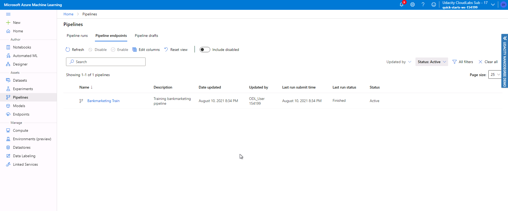
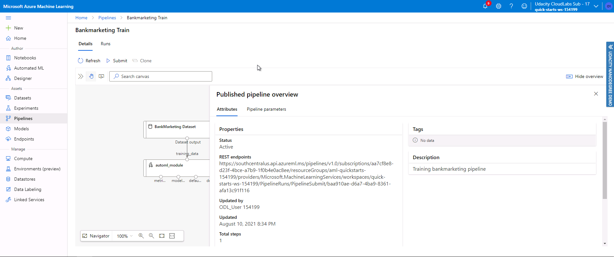

### Trigger Pipeline
Here we use the published rest endpoint to trigger the pipeline created.
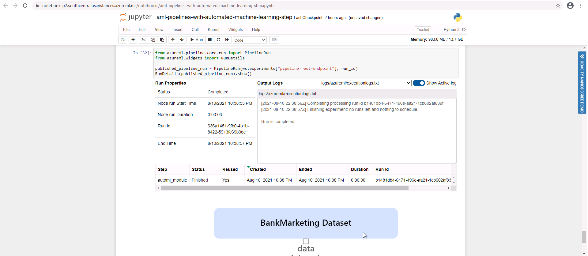
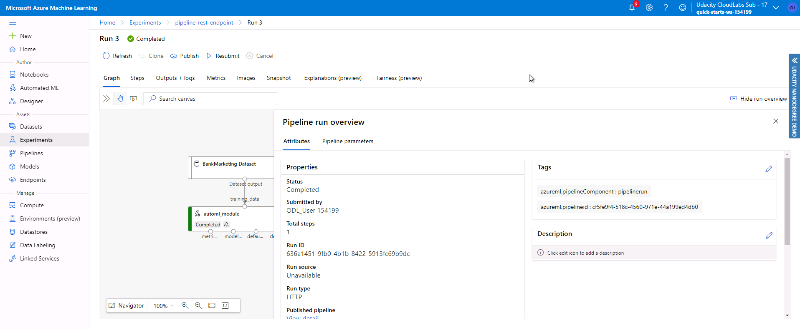

## Screen Recording
A demo for this project is available in this link https://www.youtube.com/watch?v=sH_8H4oWJa4

